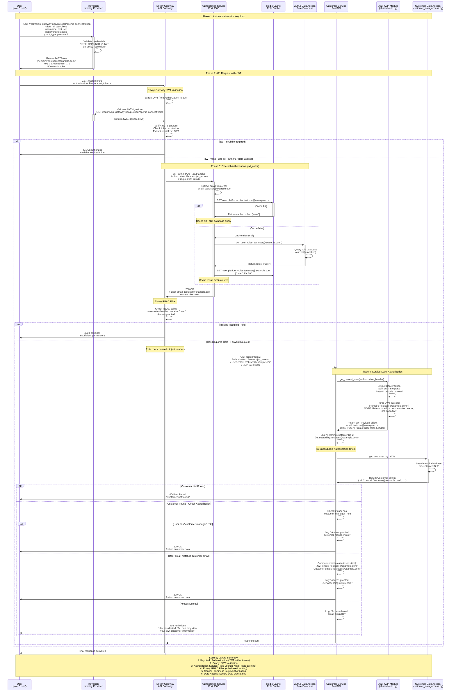

# Authentication & Authorization Flow

This document illustrates the comprehensive authentication and authorization flow in the API Gateway POC, showing how security is implemented across multiple layers.

## Overview

The system implements a layered security approach:

1. **Authentication Layer**: Keycloak handles user authentication and JWT token issuance
2. **Gateway JWT Validation**: Envoy validates JWT token signatures and expiration
3. **Gateway Authorization**: Envoy calls Authorization Service for role lookup via ext_authz
4. **Role Caching**: Redis caches user roles (5-minute TTL) for performance
5. **Gateway RBAC**: Envoy enforces role-based routing using injected role headers
6. **Service Authorization**: Individual services implement business logic authorization
7. **Data Access Layer**: Secure data operations with clean separation of concerns

## Sequence Diagram



## Security Layers Explained

### 1. Keycloak Authentication Layer
- **Purpose**: User authentication and JWT token generation
- **Responsibilities**:
  - Validate user credentials
  - Issue JWT tokens (roles NOT included due to IT policy)
  - Provide JWKS endpoint for token validation
- **Note**: JWT contains email and user info, but NOT roles

### 2. Envoy JWT Validation Layer
- **Purpose**: Validate JWT token authenticity
- **Responsibilities**:
  - Validate JWT token signatures via Keycloak JWKS
  - Check token expiration
  - Extract user email from JWT
- **Action**: If JWT invalid or expired, return 401
- **Note**: Anonymous access is available to service endpoints

### 3. Authorization Service (ext_authz) Layer
- **Purpose**: Role lookup service with caching
- **Port**: 9000
- **Responsibilities**:
  - Extract user email from JWT
  - Check Redis cache for user roles (5-minute TTL)
  - Query role database on cache miss
  - Cache results in Redis for future requests
  - Return roles in response headers (x-user-roles)
- **Roles**: `user`, `admin`, `customer-manager`, `product-manager`, `guest`, `unverified-user`

### 4. Redis Caching Layer
- **Purpose**: Performance optimization for role lookups
- **Responsibilities**:
  - Cache user roles with 5-minute TTL
  - Reduce database load
  - LRU eviction policy (256MB max memory)
- **Cache Key Format**: `user:platform-roles:{email}`

### 5. Service-Level Authorization Layer
- **Purpose**: Business logic authorization
- **Responsibilities**:
  - Decode JWT payload for user information
  - Read roles from x-user-roles header
  - Implement role-based access control (RBAC)
  - Enforce business rules (e.g., users can only access their own data)
  - Comprehensive audit logging

### 6. Data Access Layer
- **Purpose**: Secure data operations
- **Responsibilities**:
  - Abstract data access from business logic
  - Provide clean interface for data operations
  - Future database integration point

## Authorization Rules

### Customer Service
- **GET /customers**: 
  - `customer-manager` role: Access all customers
  - `user` role: Access only own customer record
- **GET /customers/{id}**: 
  - `customer-manager` role: Access any customer
  - `user` role: Access only if email matches

### Product Service
- **All GET endpoints**: `guest` role as well as all other roles
- **Future write operations**: Will require `product-manager` role

## JWT Token Structure

**IMPORTANT**: Due to IT policy restrictions, roles are NOT included in JWT tokens. Roles are retrieved separately via the Authorization Service.

```json
{
  "exp": 1761529888,
  "iat": 1761529588,
  "jti": "onrtro:f5c157db-fae7-c91c-9be1-6743885440ca",
  "iss": "http://localhost:8180/realms/api-gateway-poc",
  "sub": "ff7c5cc6-7c87-4f47-94af-f51a641dbbec",
  "typ": "Bearer",
  "azp": "test-client",
  "sid": "d1646165-67e7-5dbf-72c7-2c1b563aaba9",
  "acr": "1",
  "allowed-origins": [
    "http://127.0.0.1:*",
    "http://localhost:*"
  ],
  "scope": "profile email",
  "email_verified": true,
  "name": "Test User",
  "preferred_username": "testuser",
  "given_name": "Test",
  "family_name": "User",
  "email": "testuser@example.com"
}
```

**Note**: The `realm_access.roles` field is NOT present in production JWTs. Instead:
1. Envoy extracts the user's email from the JWT
2. Envoy calls Authorization Service via ext_authz
3. Authorization Service looks up roles from database (with Redis caching)
4. Roles are injected into request headers (`x-user-roles`) by Envoy
5. Services read roles from headers, not from JWT

## Error Responses

- **401 Unauthorized**: Invalid or missing JWT token
- **403 Forbidden**: Valid token but insufficient permissions
- **404 Not Found**: Resource doesn't exist
- **403 Business Logic**: Valid access but business rules deny operation

## Benefits of This Architecture

1. **Defense in Depth**: Seven security layers from authentication to data access
2. **Separation of Concerns**: Each layer has specific responsibilities
3. **Performance**: Redis caching reduces role lookup latency by 95%+
4. **Scalability**: Easy to add new services with consistent security
5. **Auditability**: Comprehensive logging at each layer with request tracing
6. **Flexibility**: Different authorization rules per service
7. **IT Policy Compliance**: Roles stored separately from JWT tokens
8. **Centralized Authorization**: Single source of truth for user roles
9. **Future-Proof**: Ready for database integration and additional roles
10. **High Availability**: Redis caching provides resilience if role database is slow

## Key Implementation Details

### Authorization Service Endpoints
- **POST /authz/roles**: ext_authz endpoint called by Envoy (internal)
- **GET /auth/me**: Public endpoint for React UI to fetch user info
- **GET /authz/health**: Health check including Redis cache status

### Redis Cache Configuration
- **TTL**: 5 minutes (300 seconds)
- **Max Memory**: 256MB
- **Eviction Policy**: allkeys-lru (Least Recently Used)
- **Key Format**: `user:platform-roles:{email}`

### Request Headers Flow
1. **User → Envoy**: `Authorization: Bearer <jwt>`
2. **Envoy → Authorization Service**: `Authorization: Bearer <jwt>`, `x-request-id: <uuid>`
3. **Authorization Service → Envoy**: `x-user-email: {email}`, `x-user-roles: {role1,role2}`
4. **Envoy → Service**: `Authorization: Bearer <jwt>`, `x-user-email: {email}`, `x-user-roles: {role1,role2}`

## Related Documentation

- [System Architecture](system-architecture.md)
- [Security Guide](../security/security-guide.md)
- [Authorization Service README](../../services/authz-service/README.md)
- [Keycloak Setup](../setup/keycloak-setup.md)
- [Developer Guide](../DEVELOPER_GUIDE.md)