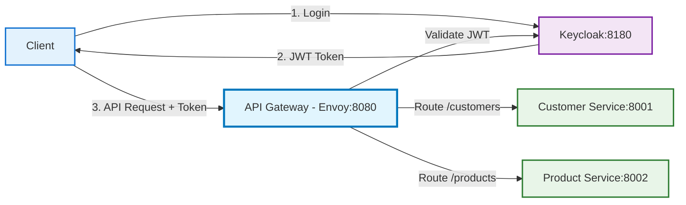
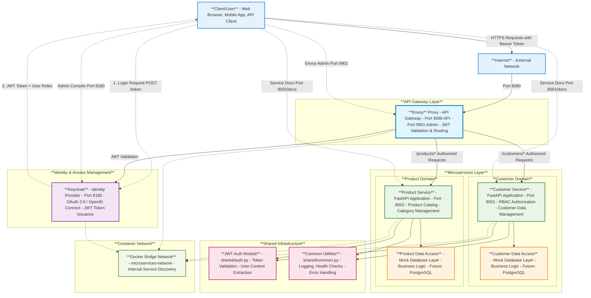

# System Architecture Overview

This document provides a high-level view of the API Gateway POC system architecture, showing the major components, their relationships, and key technical details.

## Architecture Diagram (High Level)



## Architecture Diagram (Detailed)



## Component Details

### **Envoy API Gateway** 
- **Purpose**: Single entry point for all API requests
- **Ports**: 
  - `8080` - Main API endpoint (public)
  - `9901` - Admin interface (internal)
- **Responsibilities**:
  - JWT token validation via Keycloak JWKS
  - Request routing to appropriate microservices
  - Load balancing and circuit breaking
  - Rate limiting and request/response transformation
- **Technology**: Envoy Proxy v1.31

### **Keycloak Identity Provider**
- **Purpose**: Centralized authentication and authorization
- **Port**: `8180` - HTTP interface
- **Responsibilities**:
  - User authentication (OAuth 2.0 / OpenID Connect)
  - JWT token issuance and validation
  - Role and permission management
  - JWKS endpoint for token verification
- **Technology**: Keycloak 23.0
- **Default Admin**: admin/admin (development only)

### **Customer Service**
- **Purpose**: Customer data management with RBAC
- **Port**: `8001` - FastAPI application
- **Authorization Rules**:
  - `customer-manager` role: Access all customer data
  - `user` role: Access only own customer record
- **Technology**: FastAPI 0.111.0 + Python 3.12
- **Data Layer**: Mock data (future PostgreSQL)

### **Product Service**
- **Purpose**: Product catalog and category management
- **Port**: `8002` - FastAPI application
- **Authorization**: All users with `user` role (via Envoy)
- **Technology**: FastAPI 0.111.0 + Python 3.12
- **Data Layer**: Mock data (future PostgreSQL)

### **Shared Authentication Module**
- **Location**: `services/shared/auth.py`
- **Purpose**: JWT token decoding and user context extraction
- **Features**:
  - Base64 JWT payload decoding
  - Role extraction from `realm_access.roles`
  - FastAPI dependency injection support

### **Common Utilities**
- **Location**: `services/shared/common.py`
- **Purpose**: Shared functionality across services
- **Features**:
  - Structured logging setup
  - Health check response formatting
  - Error response standardization

## Network Architecture

### Container Network
- **Name**: `microservices-network`
- **Type**: Docker Bridge Network
- **Purpose**: Internal service-to-service communication
- **DNS**: Automatic service discovery by container name

### Port Mapping

| Service | Internal Port | External Port | Purpose |
|---------|---------------|---------------|---------|
| Envoy Gateway | 8080 | 8080 | Main API |
| Envoy Admin | 9901 | 9901 | Admin Interface |
| Keycloak | 8080 | 8180 | Identity Provider |
| Customer Service | 8000 | 8001 | Customer API |
| Product Service | 8000 | 8002 | Product API |

## Security Architecture

### Authentication Flow
1. **User Login**: Client authenticates with Keycloak
2. **Token Issuance**: Keycloak returns JWT with user roles
3. **API Request**: Client sends request with Bearer token
4. **Gateway Validation**: Envoy validates JWT signature and expiration
5. **Service Authorization**: Services implement business logic RBAC

### Authorization Layers
1. **Envoy Gateway**: Role-based routing (requires `user` role minimum)
2. **Customer Service**: Fine-grained RBAC (customer-manager vs user)
3. **Product Service**: Basic access control (user role via Envoy)

### Security Features
- JWT signature validation
- Role-based access control (RBAC)
- Client secret authentication
- Comprehensive audit logging
- Request rate limiting (Envoy)
- Secure container networking

## Data Flow Patterns

### Read Operations
```
Client -> Envoy -> JWT Validation -> Service -> Data Layer -> Response
```

### Authentication
```
Client -> Keycloak -> JWT Token -> Client -> Envoy (validates) -> Service
```

### Authorization
```
Envoy (Role Check) -> Service (Business Logic RBAC) -> Data Access
```

## Future Enhancements

### Phase 3: Database Integration
- Replace mock data with PostgreSQL
- Add database connection pooling
- Implement data persistence layer

### Phase 4: CRUD Operations
- Add POST, PUT, DELETE endpoints
- Implement data validation
- Add transaction management

### Phase 5: Observability
- Jaeger distributed tracing
- Prometheus metrics collection
- Grafana dashboards

### Phase 6: Advanced Features
- Redis caching layer
- Advanced rate limiting
- Request/response transformation

## Operational Considerations

### Health Monitoring
- All services expose `/health` endpoints
- Envoy admin interface for gateway health
- Keycloak health endpoints available

### Logging Strategy
- Structured logging across all services
- Request correlation IDs
- Security event logging
- Performance metrics

### Scalability
- Horizontal scaling ready
- Stateless service design
- Load balancing via Envoy
- Container orchestration ready

## Related Documentation

- [Authentication & Authorization Flow](authentication-authorization-flow.md)
- [Security Guide](../security/security-guide.md)
- [API Documentation](../api/README.md)
- [Quick Start Guide](../../QUICK_START.md)

---

*This architecture supports enterprise-grade security while maintaining simplicity and developer productivity.*